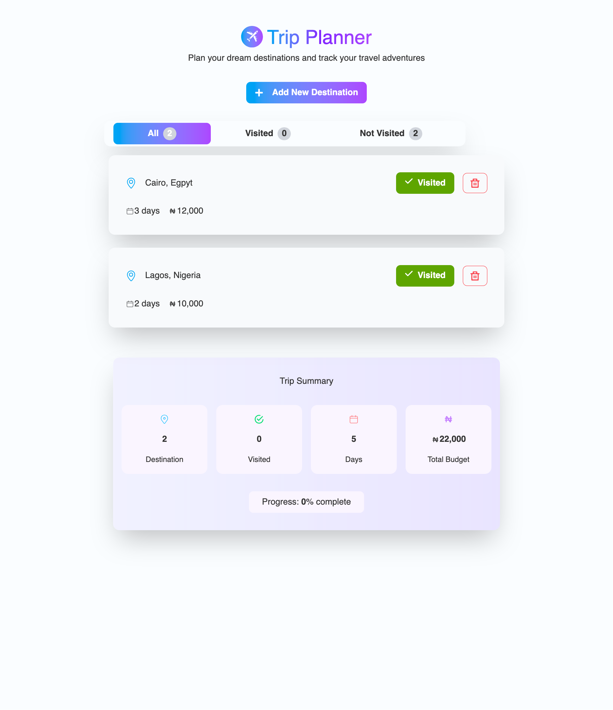

# 🌍 Tripo

A simple React app that allows users to plan trips by adding destinations, number of days, and budget.  
Built as a practice project to solidify core React fundamentals: **components, props, state, lists, and conditional rendering**.

---

## 🚀 Features
- Add a new destination with name, days, and budget
- View all destinations in a clean list
- Mark destinations as **Visited / Not Visited**
- Filter destinations: `All | Visited | Not Visited`
- Delete a destination from the list
- Summary section showing:
  - Total number of days
  - Total budget

---

## 🛠️ Built With
- **React** (functional components + hooks)
- **TailwindCSS** (for styling)


---

## 🧑‍💻 Getting Started

### 1. Clone the repo
```bash
git clone https://github.com/your-username/trip-planner.git
cd trip-planner
```
### 2. Install dependencies
```bash

npm install
```

### 3. Start the development server
```bash

npm run dev
```
 - The app will be available at http://localhost:5173 (if using Vite).

## 🎯 Learning Goals
This project was built to practice:

- Managing multiple pieces of state

- Using props to pass data and functions between components

- Handling lists with .map()

- Conditional rendering (filters, visited status, empty list messages)

- Derived state (total days, total budget)

## 📸 Screenshot


## 📝 License
This project is for learning purposes, inspired by Jonas Schmedtmann’s React course.
Feel free to fork, modify, and learn from it.

